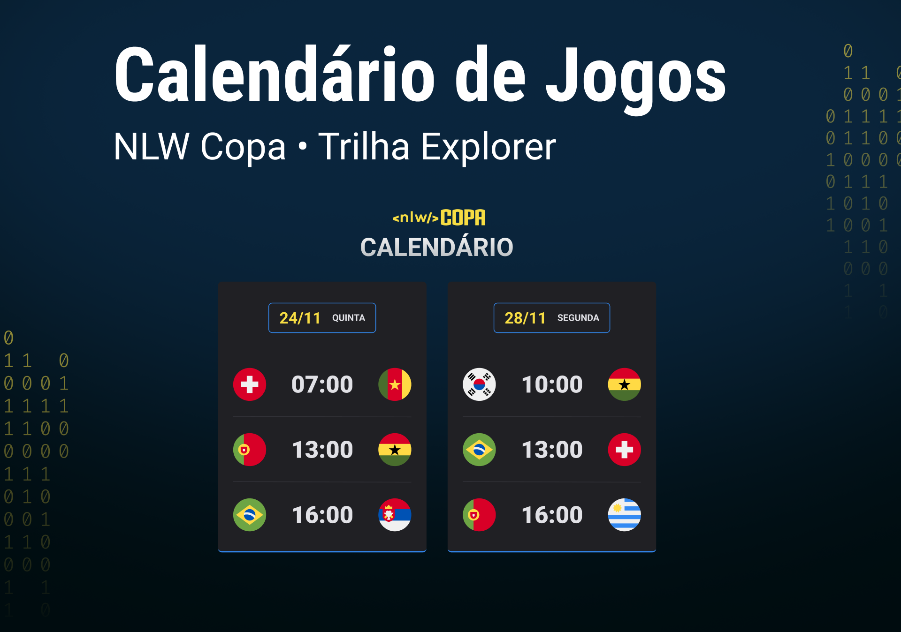

<h1 align=center> Projeto Calendário da Copa 2022 | NLW</h1>

<!---Esses são exemplos. Veja https://shields.io para outras pessoas ou para personalizar este conjunto de escudos. Você pode querer incluir dependências, status do projeto e informações de licença aqui--->

 

 

## 👾 Tecnologias

O projeto desenvolvido durante a NLW (Next Level Week) com o instrutor Mayk Brito utilizou as seguintes tecnologias:

- HTML
- CSS
- Javascript
- GIT & Github

 

## 💻 Projeto

O Calendário da Copa é um projeto que busca mostrar os jogos da Copa do Mundo de 2022 com uma interface moderna e dinâmica.

 

## 🖼️ Layout

Você pode visualizar o conceito montado no Figma [aqui!](https://www.figma.com/file/ZmGTKKVDi8rnNzY7p8gY8t/Calendário-de-Jogos-(Community)?node-id=0%3A1/duplicate). É necessário criar uma conta no [Figma](https://www.figma.com/) para visualizar o arquivo.

 

[⬆ Voltar ao topo](#explore-copa-nlw) 
